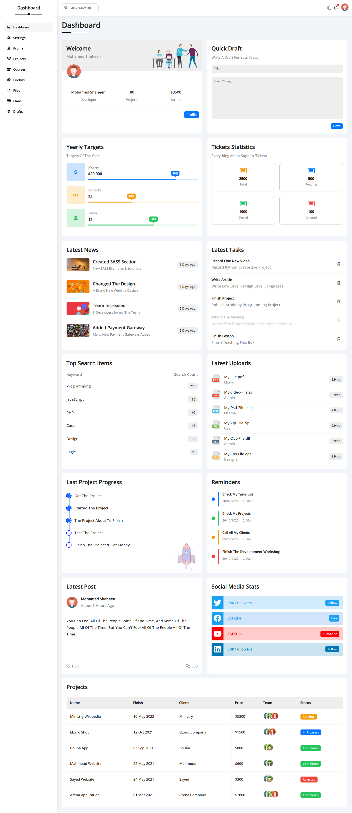

# Dashboard

A modern, responsive dashboard built with React.js. It features interactive data visualization and a clean UI design. Users can navigate seamlessly using React Router, receive real-time updates with React Toastify, and enjoy smooth loading states with React Content Loader.

## Features

- **Responsive Design**: Fully optimized for all screen sizes.
- **React Components**: Reusable and modular components for easy updates and maintenance.
- **User-friendly Navigation**: Easy-to-navigate sidebar and top navigation bar.
- **Interactive Elements**: Subtle animations and JavaScript functionality to enhance the user experience.
- **API Integration**: Seamless integration with external APIs for real-time data updates.
- **React Router**: Seamless navigation between pages.
- **React Toastify**: Real-time notifications for better user interaction.
- **React Content Loader**: Smooth loading animations for a better user experience.

## Technologies Used

- **HTML**: For structuring the content of the page.
- **CSS**: To style and layout the design.
- **Font Awesome**: For professional-grade icons.
- **React**: A JavaScript library for building user interfaces.

## Screenshots

